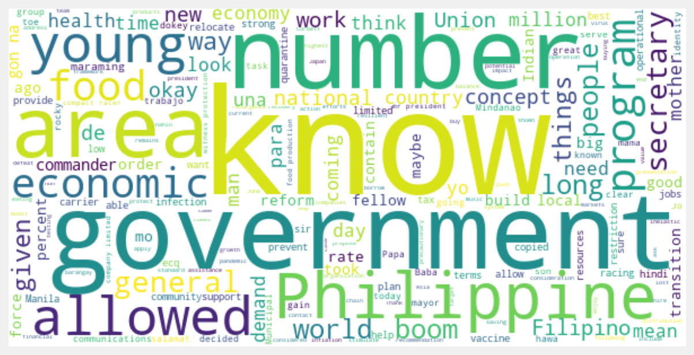

# video2nlp
[](https://travis-ci.com/jpdeleon/tql)
[](https://github.com/ambv/black)
[](https://www.gnu.org/licenses/gpl-3.0)

NLP analysis of closed caption (cc) from youtube videos

## installation
```bash
git clone https://github.com/jpdeleon/video2nlp.git
pip install -e .
python -m spacy download en
```
## example
```bash
python video2nlp.py
```


## Run at Google colab
<a href="https://colab.research.google.com/github/jpdeleon/tql/blob/master/notebooks/examples-QL.ipynb" target="_parent"></a>
